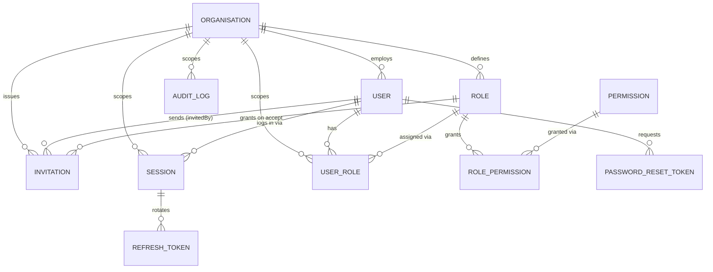
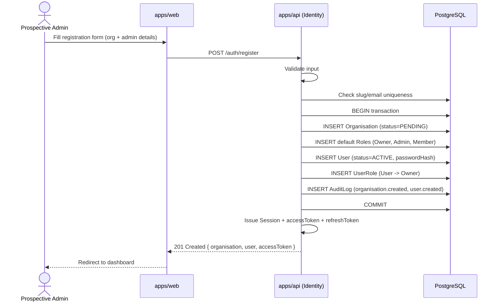
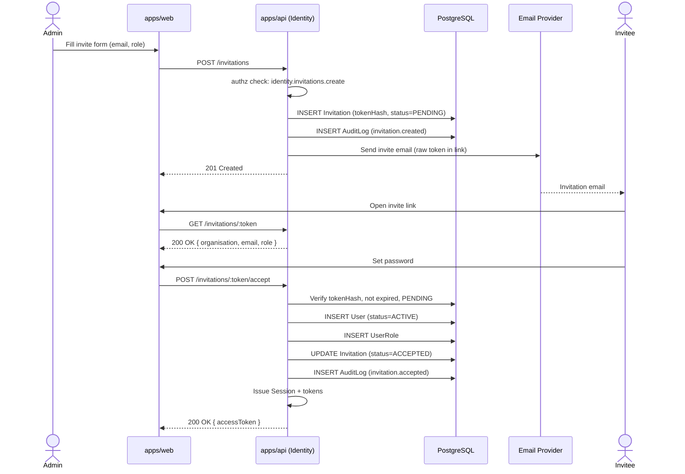
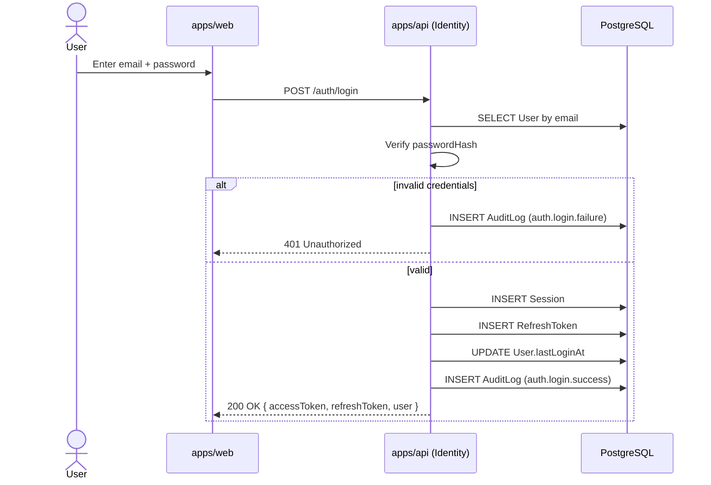
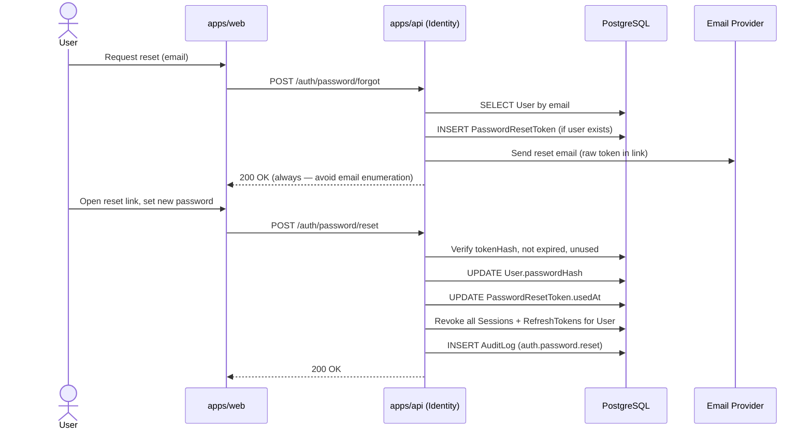
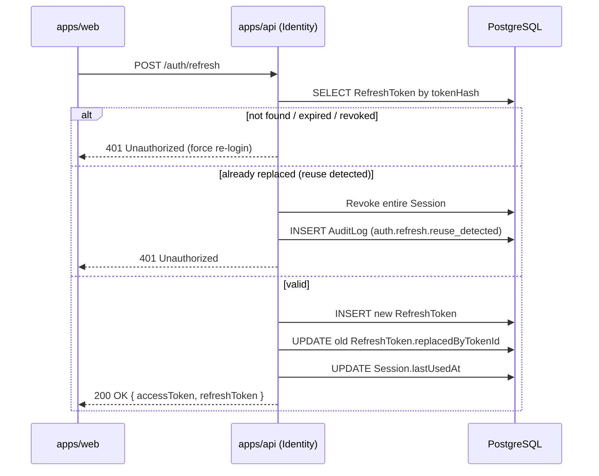
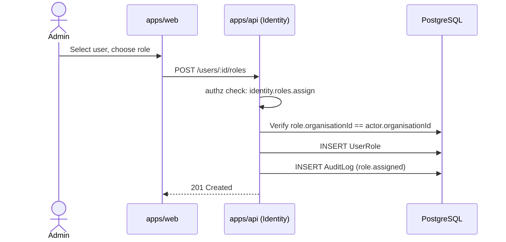

# Identity Domain — Design

- **Status:** Design only. No API, frontend, or authentication logic has been implemented.
- **Sprint:** 1A (Identity Domain Design)
- **Depends on:** [ADR-003 — Multi-Tenancy](../adr/ADR-003-multi-tenancy.md), [ADR-002 — Modular Monolith](../adr/ADR-002-modular-monolith.md)
- **See also:** [Sprint 1A Design Report](../sprint-1A-identity-design-report.md) for decisions, assumptions, and open questions behind this design.

## 1. Domain Overview

### Purpose

The Identity Domain answers one question for every other module in Zentuva: **"who is doing
this, on behalf of which organisation, and are they allowed to?"** It owns:

- **Organisations** — the tenant boundary every other domain's data lives inside.
- **Users** — the humans who log in and act within an organisation.
- **Authentication** — proving a user is who they say they are (login, sessions, tokens).
- **Authorisation** — deciding what an authenticated user is allowed to do (roles, permissions).
- **Invitations** — how new users join an organisation.
- **Audit Logging** — a durable record of who did what, when.

### Why every future module depends on it

Per [Handbook Principle 3 (Domain Ownership)](../handbook/engineering-handbook.md#5-product-principles),
every business domain owns its own data — but every domain still needs to answer "which
organisation does this row belong to?" and "is the current user allowed to touch it?". The
Identity Domain is the **only** domain that owns those two answers. Concretely:

- Every tenant-scoped table in every future domain (Product Catalogue, Procurement, Inventory,
  Production, Sales, Distribution, Finance, ...) carries an `organisationId` foreign key that
  points at `Organisation.id` — defined here.
- Every authenticated request in every future controller carries a request-scoped
  `TenantContext` (see [`packages/types/src/tenant.ts`](../../packages/types/src/tenant.ts))
  resolved by the Identity Domain's auth middleware/guard — not re-implemented per domain.
- Every permission check in every future domain (e.g. "can this user adjust inventory stock?")
  is evaluated against the RBAC model defined here, using the permission-naming convention
  defined here (§6) — future domains **register** permissions into this system, they don't build
  their own.
- Every domain that wants an audit trail (Handbook Principle 4 — every transaction generates
  intelligence) writes into the `AuditLog` table defined here, rather than inventing its own.

In short: Identity is not "a module like the others" — it is the substrate the others are built
on. This is why it is being fully designed _before_ Product Catalogue, Procurement, or any other
domain, per the Sprint 1A brief.

## 2. Business Rules

### What is an Organisation?

An **Organisation** is a company or business using Zentuva — the real-world entity that owns
data, pays for the platform, and employs the Users who log in. Boby Bites is one Organisation.
Every future tenant of Zentuva is a new Organisation row.

### What is a Tenant?

**Tenant is the architectural term for the same thing an Organisation is the business term for.**
There is no separate "Tenant" entity — `Organisation` **is** the tenant boundary. This is a
deliberate simplification of [ADR-003](../adr/ADR-003-multi-tenancy.md)'s "shared database,
tenant discriminator" model: the discriminator column on every tenant-scoped table is literally
`organisationId`. Wherever existing code or docs say "tenant" (e.g. `TenantContext.tenantId`),
read it as "this organisation's id." See §12 for why a holding-company model (one Tenant owning
multiple Organisations) is explicitly deferred, not built now.

### What is a User?

A **User** is an individual human who can log in to Zentuva. A User always belongs to exactly one
Organisation in this design (see the next rule). A User is not a business "role" like "Sales
Rep" — what a User can _do_ is determined by the Roles assigned to them (§6), not by the User
entity itself.

### Can users belong to multiple organisations?

**Not in MVP.** Each `User` row has exactly one `organisationId` (a hard foreign key, not a join
table). A person who genuinely needs to work across two Boby-Bites-like organisations would need
two separate User accounts (two different emails) in this design.

This is a deliberate MVP simplification, not an oversight — see
[Risks & Future Expansion](#12-risks--future-expansion) for the migration path to true
multi-organisation membership, and the [design report](../sprint-1A-identity-design-report.md)
for the reasoning. One forward-compatible choice **was** made now: `User.email` is globally
unique (not unique-per-organisation), which is the precondition for a future migration to
multi-org membership without a data cleanup pass.

### Who can create organisations?

Anyone — Organisation creation is **self-service**. A prospective customer fills in the
[Organisation Registration](#organisation-registration) form, which atomically creates the
Organisation and its first User, who is automatically granted the system `Owner` role (§6).
There is no platform-admin approval step in MVP.

### Who can invite users?

Any User holding a role with the `identity.invitations.create` permission — by default, `Owner`
and `Admin` (§6). Invitations are always scoped to the inviter's own organisation; there is no
mechanism to invite a user into an organisation you don't belong to.

### Who manages permissions?

Any User holding the `identity.roles.manage` permission — by default, `Owner` only, with `Admin`
able to manage non-system roles. The single system `Owner` role itself cannot be edited, renamed,
or deleted, and every organisation must always have at least one active User with the `Owner`
role (enforced at the application layer, not the database — see §4, `Role.isSystem`).

### How is tenant isolation enforced?

Every tenant-scoped table carries a non-nullable `organisationId` column, every authenticated
request resolves a `TenantContext` once (at the edge, not per-query), and every query is required
to filter by it — enforced by convention plus a Prisma Client Extension, not by Postgres Row
Level Security in MVP. Full detail in [§7](#7-tenant-isolation-strategy).

## 3. Organisation Model

Organisation data is split into two concerns with very different lifecycles: the minimal data
needed to _create_ a tenant (rarely changes after the fact), and the fuller profile an
organisation fills in once it's using the product (changes often, mostly optional).

### Organisation Registration

The **only** fields required to create an Organisation and its first User, submitted together in
a single registration action (`POST /auth/register`, §10):

| Field               | Belongs to     | Notes                                                                               |
| ------------------- | -------------- | ----------------------------------------------------------------------------------- |
| Organisation Name   | `Organisation` | Required. Also used to derive a unique `slug`.                                      |
| Business Email      | `Organisation` | Required. Organisation-level contact, distinct from the admin's login email.        |
| Country             | `Organisation` | Required. Drives default currency/timezone suggestions (not enforced) in future UI. |
| Administrator Name  | `User`         | Required. Split into `firstName`/`lastName` at the entity level.                    |
| Administrator Email | `User`         | Required. Becomes the first User's login email; must be globally unique.            |
| Password            | `User`         | Required. Hashed before storage — see §5.                                           |

Nothing else is collected at registration. Every other Organisation Profile field (below) is
optional and filled in later — this keeps time-to-first-value short, per
[Handbook Principle 1 (MVP First)](../handbook/engineering-handbook.md#5-product-principles).

### Organisation Profile

The full profile an Organisation can configure after registration:

| Field                                                  | MVP?   | Notes                                                                                                                                                               |
| ------------------------------------------------------ | ------ | ------------------------------------------------------------------------------------------------------------------------------------------------------------------- |
| Logo                                                   | MVP    | Stored as a URL (DigitalOcean Spaces, per the [architecture overview](../handbook/architecture-overview.md)); upload flow is future frontend work, not this sprint. |
| Company Description                                    | MVP    | Free text.                                                                                                                                                          |
| Industry                                               | MVP    | Free text in MVP; a controlled vocabulary is a future enhancement.                                                                                                  |
| Business Type                                          | MVP    | Free text in MVP (e.g. "Manufacturer", "Distributor"); same note as Industry.                                                                                       |
| Phone                                                  | MVP    | Free text (no format validation beyond basic sanity in MVP).                                                                                                        |
| Website                                                | MVP    | Free text URL.                                                                                                                                                      |
| Support Email                                          | MVP    | Distinct from Business Email — where customers reach this org's support.                                                                                            |
| Address                                                | MVP    | Modelled as discrete fields (line 1/2, city, state, postal code) rather than one free-text block, so future domains (e.g. Distribution) can use it structurally.    |
| Currency                                               | MVP    | Defaults to `USD`; free-text ISO code in MVP, not validated against a currency table.                                                                               |
| Time Zone                                              | MVP    | Defaults to `UTC`; free-text IANA identifier in MVP.                                                                                                                |
| Fiscal Year                                            | MVP    | Modelled as `fiscalYearStart` (month 1–12); "fiscal year" as a full accounting-period concept is Finance domain's concern, not Identity's.                          |
| Date Format                                            | MVP    | Defaults to `YYYY-MM-DD`. Purely a display preference.                                                                                                              |
| Settings                                               | MVP    | A single `Json` bucket for low-stakes, non-relational preferences (see note below).                                                                                 |
| Status                                                 | MVP    | Enum — see §4 `Organisation.status`.                                                                                                                                |
| **Future:** structured Industry/Business Type taxonomy | Future | Controlled vocabularies, likely their own reference tables once real reporting needs exist.                                                                         |
| **Future:** Currency/locale validation                 | Future | Validate against ISO 4217 / IANA timezone lists once a second country is onboarded.                                                                                 |
| **Future:** Multiple locations/addresses               | Future | MVP models one address per organisation; multi-branch is a Distribution-domain-adjacent concern.                                                                    |
| **Future:** Billing/subscription plan                  | Future | Explicitly out of scope — see §12.                                                                                                                                  |

**Why a `settings: Json` field exists:** Not every future per-organisation toggle deserves a
first-class column and a migration (e.g. "show currency symbol before or after amount"). `Json`
gives a low-ceremony escape hatch for that class of preference. It is **not** a place to smuggle
in structured business data that other domains need to query against — those get real columns or
their own tables when they exist.

## 4. Entity Design

### Overview diagram



Per-entity detail follows. Field-level types/constraints are in [§9](#9-prisma-design); this
section covers responsibility, ownership, and lifecycle.

### Organisation

- **Responsibility:** the tenant boundary. Owns its profile (§3) and is the root that every
  tenant-scoped row (in every domain, not just Identity) ultimately points back to.
- **Ownership:** owned by Identity. No other domain should ever write to this table.
- **Lifecycle:** created via self-service registration (`PENDING` → `ACTIVE` once the admin's
  email is verified, see §5). Can move to `SUSPENDED` (platform-initiated, e.g. non-payment —
  billing itself is future scope, §12) or `CLOSED` (terminal). Never hard-deleted in MVP — closing
  is a status change, preserving history for audit/legal reasons.

### User

- **Responsibility:** a single human's login identity within one Organisation.
- **Ownership:** owned by Identity. Other domains reference `User.id` (e.g. "who created this
  purchase order") but never write to the `users` table.
- **Lifecycle:** created either at Organisation registration (as `Owner`, status `ACTIVE`
  immediately) or via Invitation acceptance (status `INVITED` → `ACTIVE` on accept). Can be
  `SUSPENDED` (temporary, reversible, e.g. by an Admin) or `DEACTIVATED` (terminal, e.g. offboarded
  employee). Never hard-deleted in MVP, for the same audit/history reasons as Organisation.

### Role

- **Responsibility:** a named, organisation-scoped bundle of permissions.
- **Ownership:** owned by Identity, but the permissions a role _can_ be given (the `Permission`
  catalog) are contributed by every domain, not just Identity — see §6.
- **Lifecycle:** three system roles (`Owner`, `Admin`, `Member`) are seeded automatically when an
  Organisation is created (`isSystem = true`, cannot be renamed or deleted). Custom roles can be
  created, edited, and deleted freely by anyone with `identity.roles.manage`, as long as no User
  is left with zero roles as a result (enforced at the application layer).

### Permission

- **Responsibility:** a single, granular capability in the system (e.g.
  `identity.users.invite`). This is the **only** genuinely global (non-tenant-scoped) table in
  the domain — see the explicit callout in §7.
- **Ownership:** rows are contributed by whichever domain the capability belongs to (identified by
  the `domain` column), but the table itself lives in Identity since RBAC evaluation is Identity's
  job.
- **Lifecycle:** effectively static, seeded at build/deploy time as each domain module is
  developed (not user-editable). Deleting a permission that's in use is disallowed at the
  application layer.

### UserRole

- **Responsibility:** the join between a User and a Role — "this user has this role."
- **Ownership:** Identity.
- **Lifecycle:** created on role assignment (registration, invitation acceptance, or an explicit
  assignment action), deleted on unassignment. A User must always have at least one Role — the
  application layer prevents removing the last one.

### RolePermission

- **Responsibility:** the join between a Role and a Permission — "this role grants this
  capability."
- **Ownership:** Identity.
- **Lifecycle:** created/deleted whenever a role's permission set is edited. Not applicable to the
  `Owner` role, which bypasses this table entirely (§6 explains why).

### Invitation

- **Responsibility:** a pending offer for someone to join an Organisation with a specific Role.
- **Ownership:** Identity.
- **Lifecycle:** `PENDING` on creation → `ACCEPTED` (creates a User) or `EXPIRED` (time-based,
  application-enforced) or `REVOKED` (inviter/admin cancels it). Terminal once any of those three
  states is reached — a fresh invitation is issued rather than reopening an old one.

### Session

- **Responsibility:** represents one logged-in device/browser for one User. The parent record that
  `RefreshToken`s rotate underneath, so "log out this device" and "log out everywhere" are
  possible.
- **Ownership:** Identity.
- **Lifecycle:** created on login or invitation acceptance, `lastUsedAt` bumped on each refresh,
  `revokedAt` set on logout, password reset (all sessions), or reuse-detected token theft (§5).

### RefreshToken

- **Responsibility:** the rotating credential material for a Session — see §5 Refresh Token Flow
  for why this is a separate entity from Session rather than a field on it.
- **Ownership:** Identity.
- **Lifecycle:** one active RefreshToken per Session at a time; each use creates a new row and
  marks the old one as replaced (`replacedByTokenId`), forming a rotation chain used to detect
  token reuse/theft.

### PasswordResetToken

- **Responsibility:** a single-use, time-limited credential for the forgot-password flow. Kept
  separate from `Invitation` even though both are "prove you own this email" tokens, because their
  lifecycles and side effects differ enough (invitation creates a User; reset just changes a
  password) that overloading one entity for both would make both harder to reason about.
- **Ownership:** Identity.
- **Lifecycle:** created on a forgot-password request, consumed (`usedAt` set) on successful reset,
  otherwise expires unused.

### AuditLog

- **Responsibility:** an immutable record of a significant event, scoped to an Organisation (or
  platform-wide, if `organisationId` is null — e.g. a failed login for a nonexistent email).
- **Ownership:** the table lives in Identity, but every domain writes to it — this is the one
  table every future domain module is expected to insert into directly.
- **Lifecycle:** insert-only. Never updated or deleted by application code. See §8 for retention.

## 5. Authentication Design

All flows are described step-by-step here; the corresponding Mermaid sequence diagrams are in
[§11](#11-sequence-diagrams) (kept together there per the Sprint 1A brief's structure — each flow
below links to its diagram).

Passwords are hashed with **argon2id** (preferred over bcrypt for new systems; no legacy
constraint here since there's no existing user base). Access tokens are short-lived **JWTs**
(not stored server-side); refresh tokens are long-lived, opaque, single-use-then-rotated, and
stored **hashed** (never plaintext) — the same pattern applied to invitation and password-reset
tokens.

### Login Flow

See [diagram](#login). User submits email + password → API verifies the password hash → on
success, creates a `Session` + first `RefreshToken`, issues a JWT access token, updates
`User.lastLoginAt`, and writes an `AuditLog` entry. Failures (wrong password, unknown email,
suspended user) are indistinguishable in the response body (generic "invalid credentials") to
avoid user enumeration, but are distinguishable in the `AuditLog` for security review.

### Logout Flow

Client sends the current session's identifier (implicitly, via the access token) →
API sets `Session.revokedAt` and implicitly invalidates its `RefreshToken`s (any refresh
attempt against a revoked session's token fails) → `AuditLog` entry written. This is a single
request/response, not diagrammed separately — it's the tail end of the Login diagram's session
lifecycle.

### Password Reset Flow

See [diagram](#password-reset). Two-step: (1) request a reset — API always responds `200 OK`
regardless of whether the email exists, to avoid leaking which emails are registered — a
`PasswordResetToken` is only actually created if the user exists; (2) submit the token + new
password — API validates the token, updates the password hash, marks the token used, and **revokes
every existing Session for that user** (a password reset invalidates all prior logins, since the
old password may have been compromised).

### Invitation Flow

See [diagram](#user-invitation). An Admin/Owner creates an `Invitation` (email + role) → API
emails a link containing the raw token (only the hash is stored) → invitee opens the link, the API
validates the token and returns which organisation/role they're joining (so the frontend can show
context before the invitee commits) → invitee sets a password → API creates the `User`
(status `ACTIVE`), the `UserRole`, marks the `Invitation` `ACCEPTED`, and logs them in immediately
(issues a Session, same as Login).

### Refresh Token Flow

See [diagram](#refresh-token). Client exchanges its current refresh token for a new
access+refresh pair. The API checks three cases: the token is unknown/expired/revoked (force
re-login); the token was already rotated once before and is being reused (a strong signal of
theft — the entire `Session` is revoked and an `AuditLog` security event is written); or the token
is valid (issue a new access token, rotate to a new refresh token, mark the old one as replaced).

## 6. Authorisation Design

### RBAC strategy

Flat role-based access control, organisation-scoped: a `User` has one or more `Role`s (via
`UserRole`), each `Role` grants zero or more `Permission`s (via `RolePermission`), and an
authorisation check is "does any of this user's roles grant this permission?" There is **no
hierarchy or inheritance between roles** in MVP (see below) — this keeps the mental model and the
query simple: one join from user → roles → permissions.

### Permission naming convention

`<domain>.<resource>.<action>` — all lowercase, dot-separated.

- `domain` — the owning module, e.g. `identity`, and in future `inventory`, `sales`.
- `resource` — the noun being acted on, e.g. `users`, `roles`, `invitations`.
- `action` — a verb from a small, shared vocabulary so permissions stay predictable across
  domains: `create`, `read`, `update`, `delete`, `manage` (full control, implies the other four
  for that resource), plus a small number of domain-specific verbs where CRUD doesn't fit
  (`invite`, `assign`, `revoke`).

Examples defined by Identity itself:

| Key                           | Meaning                                      |
| ----------------------------- | -------------------------------------------- |
| `identity.users.read`         | View users in the organisation               |
| `identity.users.update`       | Edit a user's profile / suspend / reactivate |
| `identity.invitations.create` | Invite a new user                            |
| `identity.invitations.revoke` | Cancel a pending invitation                  |
| `identity.roles.manage`       | Create/edit/delete non-system roles          |
| `identity.roles.assign`       | Assign/unassign roles on users               |
| `identity.audit-logs.read`    | View the organisation's audit log            |

Future domains follow the same pattern (e.g. `inventory.stock.adjust`) and register their
permissions into the shared `Permission` table — Identity does not need to know what those
permissions mean, only that they exist.

### Default system roles

Seeded automatically for every new Organisation at registration, marked `isSystem = true`
(cannot be renamed, edited, or deleted):

| Role     | Intent                                                                                                                                                                                                                    |
| -------- | ------------------------------------------------------------------------------------------------------------------------------------------------------------------------------------------------------------------------- |
| `Owner`  | Full control. Exactly one Organisation-creating User starts as Owner. Bypasses `RolePermission` entirely — see below. Cannot be removed if it would leave the organisation with zero Owners.                              |
| `Admin`  | Day-to-day organisation management: invite/manage users, manage non-system roles, view audit logs. Cannot manage billing (future) or the `Owner` role.                                                                    |
| `Member` | Baseline authenticated user with no special permissions beyond reading their own profile. The default role for anyone whose actual access should come entirely from custom, domain-specific roles added in later sprints. |

**Why `Owner` bypasses `RolePermission`:** requiring every single permission ever registered by
every future domain to be explicitly granted to `Owner` would mean every new domain module has to
remember to also grant its permissions to `Owner`, which will eventually be forgotten. Instead,
authorisation checks treat "has the `Owner` role" as an automatic pass, independent of the
`RolePermission` table. `Admin` and `Member` (and all custom roles) are ordinary explicit grants.

### Custom roles

Any Organisation can create additional roles (e.g. "Warehouse Manager", "Sales Rep") once the
domains those roles need permissions from exist. Identity does not predefine these — that would
violate [Handbook Principle 2 (Configuration Over Customisation)](../handbook/engineering-handbook.md#5-product-principles):
Boby Bites' operational roles are Boby Bites' configuration, not Identity's schema. Identity only
provides the mechanism (Role, Permission, RolePermission) and the seeded starting point (Owner,
Admin, Member).

### Permission inheritance

**None in MVP.** No "Admin inherits everything Member has" hierarchy — each role's permissions
are its explicit `RolePermission` rows (with `Owner` as the sole, special "implicitly has
everything" exception above). This is simpler to audit ("what can this role do?" is one query,
not a graph walk) at the cost of some duplication when roles overlap. Flagged as a candidate
future enhancement in §12 if role proliferation makes the duplication painful in practice.

## 7. Tenant Isolation Strategy

### How isolation is achieved

Per [ADR-003](../adr/ADR-003-multi-tenancy.md): a single shared Postgres database, with every
tenant-scoped table carrying a non-nullable `organisationId` column (see §9 for exactly which
tables). There is no database-level isolation (no separate schema per tenant, no Postgres Row
Level Security) in MVP — isolation is enforced in the application layer, in two complementary
ways:

1. **Request-scoped `TenantContext`, resolved once.** An authenticated request resolves its
   `organisationId` exactly once (from the validated JWT access token, in an auth guard/middleware
   run before any domain code executes) into the existing
   [`TenantContext`](../../packages/types/src/tenant.ts) type. Domain services receive this
   context rather than re-deriving it, so there is exactly one place tenant resolution can go
   wrong, not one per domain.
2. **A Prisma Client Extension that scopes every query.** Rather than trusting every developer
   (human or AI) to remember `where: { organisationId }` on every single query across every
   future domain, the recommended implementation (Sprint 1B+) is a
   [Prisma Client Extension](https://www.prisma.io/docs/orm/prisma-client/client-extensions) that
   automatically injects the current request's `organisationId` into `where` clauses for every
   tenant-scoped model, and rejects writes that don't carry it. This is defense-in-depth on top of
   (1), not a replacement for it — a bug in either layer alone shouldn't be enough to leak data
   across tenants.

### How future modules should respect tenant boundaries

Every model a future domain adds that isn't genuinely global (like `Permission`) must include an
`organisationId` column with the same shape used here: non-nullable, indexed, foreign-keyed to
`Organisation.id`, `onDelete: Cascade`. Domain services must obtain the current `organisationId`
from the injected `TenantContext` — never from a client-supplied field in the request body (a
request should never be able to say "act on organisation X" for any X other than the one its
token was issued for).

### How queries stay tenant-safe

Three layers, from cheapest-to-bypass-by-accident to hardest:

1. **Convention + code review:** every domain service method that touches a tenant-scoped table
   takes tenant context as a parameter (or reads it from a scoped provider) and includes it in
   the query. Reviewed per the existing
   [Definition of Done](../handbook/engineering-handbook.md#12-definition-of-done).
2. **The Prisma Client Extension above:** the automatic safety net.
3. **Tests:** the recommended pattern (Sprint 1B+) is a shared test helper that creates two
   organisations' worth of data and asserts that queries scoped to organisation A never return
   organisation B's rows — run against every new tenant-scoped table as it's added, not just
   Identity's own tables.

Denormalised `organisationId` columns on join/child tables that could otherwise derive it via a
relation (e.g. `UserRole.organisationId`, `Session.organisationId` — see §9) are a deliberate part
of this strategy: they let the isolation layer scope a query directly, without first joining
through a parent table to discover which tenant a row belongs to.

## 8. Audit Strategy

### Events to capture (Identity domain's own events; future domains add their own)

| Action                                          | When                                          |
| ----------------------------------------------- | --------------------------------------------- |
| `organisation.created`                          | Self-service registration completes           |
| `organisation.updated`                          | Profile fields changed                        |
| `organisation.status_changed`                   | Suspended/reactivated/closed                  |
| `user.created`                                  | Via registration or invitation acceptance     |
| `user.updated`                                  | Profile changed                               |
| `user.status_changed`                           | Suspended/reactivated/deactivated             |
| `auth.login.success` / `.failure`               | Every login attempt, success or failure       |
| `auth.logout`                                   | Explicit logout                               |
| `auth.password.reset`                           | Password successfully reset                   |
| `auth.refresh.reuse_detected`                   | Refresh token reuse (possible theft) — see §5 |
| `invitation.created` / `.revoked` / `.accepted` | Full invitation lifecycle                     |
| `role.created` / `.updated` / `.deleted`        | Custom role changes                           |
| `role.assigned` / `.unassigned`                 | A user's role membership changes              |

### Data stored per event

Matches the `AuditLog` entity in §4/§9: `organisationId` (nullable, for pre-organisation events
like a failed login on an unknown email), `actorUserId` (nullable, for unauthenticated events),
`action` (from the table above), `entityType`/`entityId` (what was acted on, e.g.
`entityType: "User", entityId: "<id>"`), `metadata` (a `Json` bag for event-specific detail, e.g.
which fields changed — deliberately unstructured so new event types don't need schema changes),
`ipAddress`, `userAgent`, `createdAt`.

### Retention considerations

No automated deletion in MVP — rows accumulate indefinitely. This is a conscious short-term
choice (simplicity over premature optimisation, per
[Handbook Principle 1](../handbook/engineering-handbook.md#5-product-principles)), flagged as
something to revisit once real volume exists: likely a partition-by-month or archive-to-cold-storage
strategy before this becomes an operational problem, not before.

### Future reporting possibilities

A per-organisation "security & activity" view (who logged in when, from where, what changed) is a
natural Admin-facing feature once the frontend exists. Longer-term, `AuditLog` is also the
natural feed for the platform-wide Business Intelligence goal in the
[Core Design Goals](../handbook/engineering-handbook.md#6-core-design-goals) — not just a security
log, but a record every future analytics feature can query against.

## 9. Prisma Design

The schema below was written to `apps/api/prisma/schema.prisma`'s eventual Identity section and
validated with `prisma validate` (and `prisma format`) against a scratch copy — it is **not**
present in the real `schema.prisma` yet, per the Sprint 1A brief ("no implementation beyond what
is necessary to validate the design"). Implementing it for real is Sprint 1B's job.

### Design notes (relationships, indexes, constraints, naming)

- **Naming:** PascalCase Prisma model names, `camelCase` fields, mapped to `snake_case` table
  names via `@@map` — consistent with the rest of the codebase's SQL conventions and independent
  of the Prisma-side naming (so a future non-Prisma tool reading the DB directly sees normal SQL
  naming).
- **IDs:** `cuid()` rather than auto-increment integers — safe to generate client-side, don't leak
  row counts, and collision-safe if MVP ever needs offline/optimistic record creation.
- **Every tenant-scoped table** has a non-nullable, indexed `organisationId`. The only table that
  doesn't is `Permission` (intentionally global, §7).
- **`onDelete` behavior:** `Cascade` from `Organisation`/`User`/`Role`/`Session` down to their
  dependents (deleting a Session should delete its RefreshTokens; in practice Organisations/Users
  are status-flagged rather than hard-deleted, but the cascade exists for correctness and test
  cleanup). `Restrict` on `Invitation.role`/`Invitation.invitedBy` — an invitation shouldn't be
  able to silently lose its role or inviter. `SetNull` on `AuditLog.organisation` — audit history
  should outlive the organisation record it references, if that record is ever hard-deleted.
- **Unique constraints:** `Organisation.slug`, `User.email` (global — see §2), `Permission.key`,
  composite `(organisationId, name)` on `Role`, composite `(userId, roleId)` on `UserRole`,
  composite `(roleId, permissionId)` on `RolePermission`, and `tokenHash` on every token-bearing
  table (`Invitation`, `RefreshToken`, `PasswordResetToken`).
- **Token storage:** every credential-bearing token (invitation, refresh, password reset) stores
  only a `tokenHash`, never the raw token — the raw value exists only in the email link / API
  response at issuance time and is never persisted.
- **`RefreshToken` rotation chain:** `replacedByTokenId` is a nullable, unique, self-referencing
  FK — modelling "this token was replaced by that one" as an explicit one-to-one link, which is
  what makes reuse detection in §5 possible (if a client presents a token that already has a
  `replacedByTokenId`, it's a reused/stolen token).

### Schema

```prisma
enum OrganisationStatus {
  PENDING
  ACTIVE
  SUSPENDED
  CLOSED
}

enum UserStatus {
  INVITED
  ACTIVE
  SUSPENDED
  DEACTIVATED
}

enum InvitationStatus {
  PENDING
  ACCEPTED
  EXPIRED
  REVOKED
}

model Organisation {
  id            String             @id @default(cuid())
  name          String
  slug          String             @unique
  businessEmail String
  country       String
  status        OrganisationStatus @default(PENDING)

  logoUrl         String?
  description     String?
  industry        String?
  businessType    String?
  phone           String?
  website         String?
  supportEmail    String?
  addressLine1    String?
  addressLine2    String?
  city            String?
  state           String?
  postalCode      String?
  currency        String  @default("USD")
  timeZone        String  @default("UTC")
  fiscalYearStart Int     @default(1)
  dateFormat      String  @default("YYYY-MM-DD")
  settings        Json    @default("{}")

  createdAt DateTime @default(now())
  updatedAt DateTime @updatedAt

  users       User[]
  roles       Role[]
  invitations Invitation[]
  auditLogs   AuditLog[]
  sessions    Session[]
  userRoles   UserRole[]

  @@map("organisations")
}

model User {
  id              String     @id @default(cuid())
  organisationId  String
  email           String     @unique
  firstName       String
  lastName        String
  passwordHash    String
  status          UserStatus @default(INVITED)
  emailVerifiedAt DateTime?
  lastLoginAt     DateTime?
  createdAt       DateTime   @default(now())
  updatedAt       DateTime   @updatedAt

  organisation    Organisation         @relation(fields: [organisationId], references: [id], onDelete: Cascade)
  userRoles       UserRole[]
  sessions        Session[]
  sentInvitations Invitation[]         @relation("InvitedBy")
  passwordResets  PasswordResetToken[]

  @@index([organisationId])
  @@map("users")
}

model Role {
  id             String   @id @default(cuid())
  organisationId String
  name           String
  description    String?
  isSystem       Boolean  @default(false)
  createdAt      DateTime @default(now())
  updatedAt      DateTime @updatedAt

  organisation    Organisation     @relation(fields: [organisationId], references: [id], onDelete: Cascade)
  userRoles       UserRole[]
  rolePermissions RolePermission[]
  invitations     Invitation[]

  @@unique([organisationId, name])
  @@index([organisationId])
  @@map("roles")
}

model Permission {
  id          String   @id @default(cuid())
  key         String   @unique
  domain      String
  description String?
  createdAt   DateTime @default(now())

  rolePermissions RolePermission[]

  @@index([domain])
  @@map("permissions")
}

model UserRole {
  id             String   @id @default(cuid())
  userId         String
  roleId         String
  organisationId String
  assignedById   String?
  assignedAt     DateTime @default(now())

  user         User         @relation(fields: [userId], references: [id], onDelete: Cascade)
  role         Role         @relation(fields: [roleId], references: [id], onDelete: Cascade)
  organisation Organisation @relation(fields: [organisationId], references: [id], onDelete: Cascade)

  @@unique([userId, roleId])
  @@index([organisationId])
  @@map("user_roles")
}

model RolePermission {
  id           String   @id @default(cuid())
  roleId       String
  permissionId String
  createdAt    DateTime @default(now())

  role       Role       @relation(fields: [roleId], references: [id], onDelete: Cascade)
  permission Permission @relation(fields: [permissionId], references: [id], onDelete: Cascade)

  @@unique([roleId, permissionId])
  @@map("role_permissions")
}

model Invitation {
  id             String           @id @default(cuid())
  organisationId String
  email          String
  roleId         String
  invitedById    String
  tokenHash      String           @unique
  status         InvitationStatus @default(PENDING)
  expiresAt      DateTime
  acceptedAt     DateTime?
  createdAt      DateTime         @default(now())

  organisation Organisation @relation(fields: [organisationId], references: [id], onDelete: Cascade)
  role         Role         @relation(fields: [roleId], references: [id], onDelete: Restrict)
  invitedBy    User         @relation("InvitedBy", fields: [invitedById], references: [id], onDelete: Restrict)

  @@index([organisationId, email])
  @@map("invitations")
}

model Session {
  id             String    @id @default(cuid())
  userId         String
  organisationId String
  userAgent      String?
  ipAddress      String?
  createdAt      DateTime  @default(now())
  lastUsedAt     DateTime  @default(now())
  revokedAt      DateTime?

  user          User           @relation(fields: [userId], references: [id], onDelete: Cascade)
  organisation  Organisation   @relation(fields: [organisationId], references: [id], onDelete: Cascade)
  refreshTokens RefreshToken[]

  @@index([userId])
  @@index([organisationId])
  @@map("sessions")
}

model RefreshToken {
  id                String    @id @default(cuid())
  sessionId         String
  tokenHash         String    @unique
  createdAt         DateTime  @default(now())
  expiresAt         DateTime
  revokedAt         DateTime?
  replacedByTokenId String?   @unique

  session         Session       @relation(fields: [sessionId], references: [id], onDelete: Cascade)
  replacedByToken RefreshToken? @relation("TokenRotation", fields: [replacedByTokenId], references: [id])
  replacesToken   RefreshToken? @relation("TokenRotation")

  @@index([sessionId])
  @@map("refresh_tokens")
}

model PasswordResetToken {
  id        String    @id @default(cuid())
  userId    String
  tokenHash String    @unique
  expiresAt DateTime
  usedAt    DateTime?
  createdAt DateTime  @default(now())

  user User @relation(fields: [userId], references: [id], onDelete: Cascade)

  @@index([userId])
  @@map("password_reset_tokens")
}

model AuditLog {
  id             String   @id @default(cuid())
  organisationId String?
  actorUserId    String?
  action         String
  entityType     String
  entityId       String?
  metadata       Json     @default("{}")
  ipAddress      String?
  userAgent      String?
  createdAt      DateTime @default(now())

  organisation Organisation? @relation(fields: [organisationId], references: [id], onDelete: SetNull)

  @@index([organisationId, createdAt])
  @@index([entityType, entityId])
  @@map("audit_logs")
}
```

## 10. API Contract Design

Illustrative only — **nothing below is implemented**. Request/response bodies are sketched, not
exhaustive (validation rules, error shapes, and pagination details are Sprint 1B implementation
concerns). All routes are implicitly scoped to the caller's organisation via their access token
except registration and the pre-login auth routes.

### Auth

| Endpoint                     | Input                                                                                               | Output                                                  |
| ---------------------------- | --------------------------------------------------------------------------------------------------- | ------------------------------------------------------- |
| `POST /auth/register`        | `{ organisationName, businessEmail, country, adminFirstName, adminLastName, adminEmail, password }` | `201 { organisation, user, accessToken, refreshToken }` |
| `POST /auth/login`           | `{ email, password }`                                                                               | `200 { user, accessToken, refreshToken }` or `401`      |
| `POST /auth/logout`          | _(access token)_                                                                                    | `204`                                                   |
| `POST /auth/refresh`         | `{ refreshToken }`                                                                                  | `200 { accessToken, refreshToken }` or `401`            |
| `POST /auth/password/forgot` | `{ email }`                                                                                         | `200` (always, see §5)                                  |
| `POST /auth/password/reset`  | `{ token, newPassword }`                                                                            | `200` or `400` (invalid/expired token)                  |
| `GET /auth/me`               | _(access token)_                                                                                    | `200 { user, organisation, permissions[] }`             |

### Organisations

| Endpoint                  | Input                                 | Output                                    |
| ------------------------- | ------------------------------------- | ----------------------------------------- |
| `GET /organisations/me`   | —                                     | `200 { organisation }` (full profile, §3) |
| `PATCH /organisations/me` | Partial `Organisation` profile fields | `200 { organisation }`                    |

### Users

| Endpoint                  | Input                                                  | Output                                                                                                                       |
| ------------------------- | ------------------------------------------------------ | ---------------------------------------------------------------------------------------------------------------------------- |
| `GET /users`              | Query: pagination, `status` filter                     | `200 { items: User[], page, pageSize, total }` (see [`packages/types`](../../packages/types/src/api.ts) `PaginatedResponse`) |
| `GET /users/:id`          | —                                                      | `200 { user, roles[] }`                                                                                                      |
| `PATCH /users/:id`        | Partial `{ firstName, lastName }`                      | `200 { user }`                                                                                                               |
| `PATCH /users/:id/status` | `{ status: "SUSPENDED" \| "ACTIVE" \| "DEACTIVATED" }` | `200 { user }`                                                                                                               |

### Invitations

| Endpoint                          | Input                  | Output                                      |
| --------------------------------- | ---------------------- | ------------------------------------------- |
| `POST /invitations`               | `{ email, roleId }`    | `201 { invitation }`                        |
| `GET /invitations`                | Query: `status` filter | `200 { items: Invitation[] }`               |
| `DELETE /invitations/:id`         | —                      | `204`                                       |
| `GET /invitations/:token`         | — (unauthenticated)    | `200 { organisationName, email, roleName }` |
| `POST /invitations/:token/accept` | `{ password }`         | `200 { user, accessToken, refreshToken }`   |

### Roles & Permissions

| Endpoint                          | Input                                             | Output                                                 |
| --------------------------------- | ------------------------------------------------- | ------------------------------------------------------ |
| `GET /roles`                      | —                                                 | `200 { items: Role[] }`                                |
| `POST /roles`                     | `{ name, description?, permissionKeys[] }`        | `201 { role }`                                         |
| `PATCH /roles/:id`                | Partial `{ name, description, permissionKeys[] }` | `200 { role }` (403 if `isSystem`)                     |
| `DELETE /roles/:id`               | —                                                 | `204` (403 if `isSystem` or still assigned)            |
| `GET /permissions`                | —                                                 | `200 { items: Permission[] }` (read-only catalog)      |
| `POST /users/:id/roles`           | `{ roleId }`                                      | `201`                                                  |
| `DELETE /users/:id/roles/:roleId` | —                                                 | `204` (400 if it would leave the user with zero roles) |

### Sessions

| Endpoint               | Input | Output                                                  |
| ---------------------- | ----- | ------------------------------------------------------- |
| `GET /sessions`        | —     | `200 { items: Session[] }` (current user's own devices) |
| `DELETE /sessions/:id` | —     | `204`                                                   |
| `DELETE /sessions`     | —     | `204` (revoke all except the current session)           |

### Audit

| Endpoint          | Input                                                       | Output                                                                                   |
| ----------------- | ----------------------------------------------------------- | ---------------------------------------------------------------------------------------- |
| `GET /audit-logs` | Query: pagination, `action`/`entityType`/date-range filters | `200 { items: AuditLog[], page, pageSize, total }` (requires `identity.audit-logs.read`) |

## 11. Sequence Diagrams

### Organisation Registration



### User Invitation



### Login



### Password Reset



### Refresh Token



### Role Assignment



## 12. Risks & Future Expansion

The following are **explicitly future capabilities, not MVP requirements**. Each is noted here so
the current design doesn't accidentally foreclose them, without building them now
([Handbook Principle 9 — Build for Growth, Release for Today](../handbook/engineering-handbook.md#5-product-principles)).

| Capability                                   | Note on today's design                                                                                                                                                                                                                                                                                                                                                                                                                                                 |
| -------------------------------------------- | ---------------------------------------------------------------------------------------------------------------------------------------------------------------------------------------------------------------------------------------------------------------------------------------------------------------------------------------------------------------------------------------------------------------------------------------------------------------------- |
| **Social login** (Google/Microsoft OAuth)    | `User.passwordHash` would need to become optional, and a new `AuthProvider`-style table would map external identities to Users. Doesn't conflict with anything modeled here.                                                                                                                                                                                                                                                                                           |
| **SSO (SAML/OIDC for enterprise customers)** | Likely an `Organisation`-level setting (§3 `settings` JSON, or a first-class field once real) plus a new flow alongside Login. No structural blocker.                                                                                                                                                                                                                                                                                                                  |
| **Multi-organisation users**                 | The biggest deferred decision (§2). Migration path: introduce a `Membership` join table between `User` and `Organisation` (replacing `User.organisationId`), backfill one `Membership` per existing user, and change `TenantContext` resolution to depend on "which org is currently active" rather than "the user's one org." Choosing a globally-unique `User.email` now (§2) is what keeps this migration additive rather than requiring a data-deduplication pass. |
| **Subscription plans / billing**             | Not modeled at all yet. Would likely be its own domain (a future `Billing` module) that reads `Organisation.status` and can transition it to `SUSPENDED`, rather than living inside Identity.                                                                                                                                                                                                                                                                          |
| **MFA (TOTP/SMS)**                           | Additive: a new `MfaMethod` table keyed on `User`, plus a step in the Login flow. Doesn't change anything modeled here.                                                                                                                                                                                                                                                                                                                                                |
| **API keys**                                 | Would need a new entity (e.g. `ApiKey`) distinct from `Session`/`RefreshToken`, since API keys are long-lived and not tied to a browser session. Same `organisationId` isolation model would apply.                                                                                                                                                                                                                                                                    |
| **Service accounts**                         | A `User`-like entity without a human behind it, for machine-to-machine access — likely a `type: HUMAN \| SERVICE` discriminator on `User`, or a parallel entity, once there's a concrete need (e.g. a future integration).                                                                                                                                                                                                                                             |

None of the above are required to make the MVP Identity Domain (this document) implementable and
correct — they are recorded so implementation decisions in Sprint 1B don't have to be revisited
later just to make room for them.
